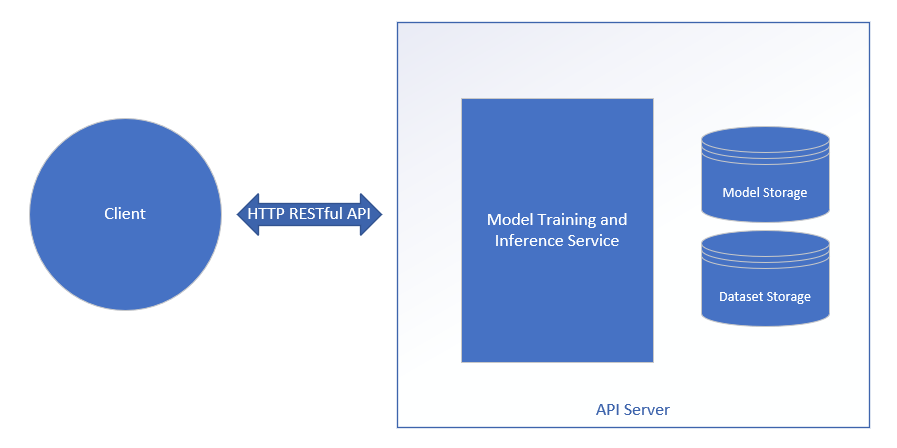
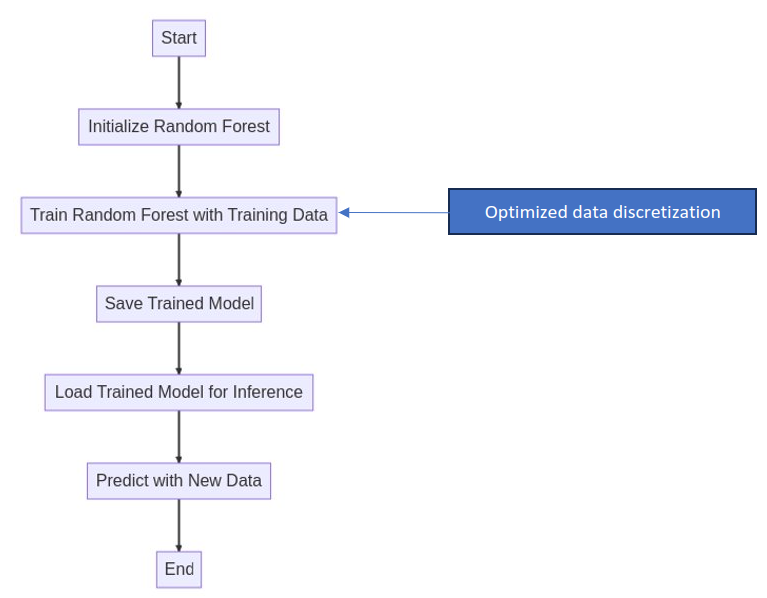
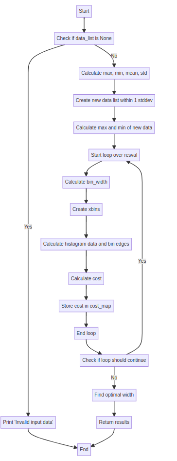

# Name of Microservice

## Overview

The Optimized Random Forest Classifier: Training and Inference Microservice is a random forest classifier creation and inference tool designed to use new Intel-desigend optimization techniques to create smaller, faster, and still as accurate random forest models for classification and regression tasks.

It is delivered as a flexible microservice, capable of being used either on its own through its RESTful HTTP API or integrated into a wider microservice-based system.

## How It Works

The microservice is designed as containerized API Server that manages an internal model training and inference service. The client communicates with the container using the API Server's RESTful HTTP API, and the API Server translates those requests into the appropriate commands to the model service.



Inside the microservice is an the actual training and inference service. Below is a diagram showing the internal architecture of the microservice in training mode. 



The service utilized an Intel-patented optimized data discretization algorithm to create a smaller, faster, and still nearly as accurate random forest model.

```
Optimized Data Discretization Granted Patent No. 10,685,081, grant date 06/16/2020
```
Some aspects of this application also utilize pending patents: 
```
OPTIMIZED DECISION TREE MACHINE LEARNING FOR RESOURCE-CONSTRAINED DEVICES Patent filing # 16/902,063 filing date 6/15/2020

MEMORY-EFFICIENT SYSTEM FOR DECISION TREE MACHINE LEARNING, Patent filed # 17/120,059 filing date 12/11/20
```



## Licensing Information
This repository is licensed under the Apache 2.0 license [LICENSE](License.txt). This project also utilizes the Random Forest algorithm provided by SciKit Learn, which is licensed under the BSD 3-Clause License. Information on that algorithms license can be found at their repository [here](https://github.com/scikit-learn/scikit-learn/tree/main).

## Learn More

-   Get started with the microservice using the [Get Started
    Guide](get-started-guide.md).
-   Follow step-by-step examples to become familiar with the core
    functionality of the microservice, in [Tutorials](tutorials.md).
